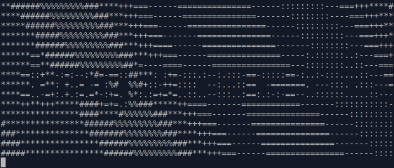
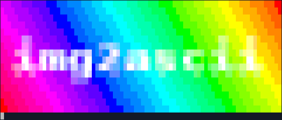
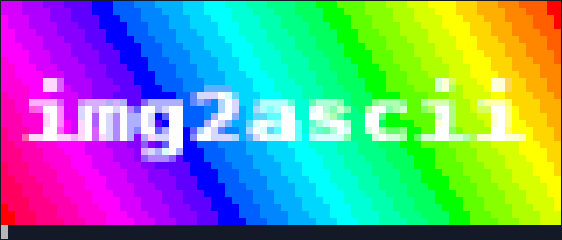
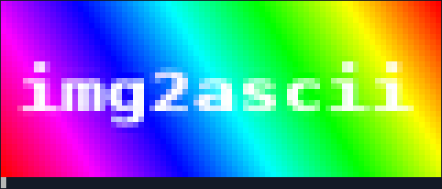

# img2ascii

[](https://pkg.go.dev/github.com/aquilax/img2ascii) | [](https://goreportcard.com/report/github.com/aquilax/img2ascii)

Image to ascii (and not only) conversion library and command line tool

## Usage

```go

func ExampleImage_Encode() {
	ascii.NewImage().Encode(os.Stdout, i)
	// Output:
	// =++++***###%%%%%%%%%######****************######
	// ===+++***###%%%%%%%%%######****************#####
	// -===+++***###%%%%%%%%%######****************####
	// --===+++***###%%%%%%%%%######****************###
	// ---===+++***###%%%%%%%%%######****************##
	// ----===+++***###%%%%%%%%%######****************#
	// -----===+++***###%%%%%%%%%######****************
	// ------===+++***###%%%%%%%%%######***************
	// -------===+++***###%%%%%%%%%######**************
	// ==------===+++***###%%%%%%%%%######*************
	// ===------===+++***###%%%%%%%%%######************
	// ====------===+++***###%%%%%%%%%######***********
	// =====------===+++***###%%%%%%%%%######**********
	// ======------===+++***###%%%%%%%%%######*********
	// =======------===+++***###%%%%@%%%%######********
	// ========------===+++***###%%%@%%%%%######*******
	// =========------===+++***###%%@%%%%%%######******
	// ===#@@===@@*--@#@*%@#+*@%@%#%@%%@@@%%######*****
	// ===@*=====+@--@+=@*+@++@##@##@%%@@%@%%######****
	// ===*%%==#@@@--@--@==@++@**@##@%%@@@@%%@@#####***
	// =====%*=@++@=-@--@-=@=+@*#@**@##@@%%%%%%%#####**
	// ===@@%==#@#@==@--@--@==@%@#**@##%@@@%%%%%%######
	// ===============------==@+++****###%%%%%%%%%#####
	// -===============------=@=++++***###%%%%%%%%%####
	// --=*@@===@=======------====+++***###%%%%%%%%%###
	// ---@==@==@========-------===+++***###%%%%%%%%%##
	// ---@=====@=========-------===+++***###%%%%%%%%%#
	// --@@@=@==@==+@@*====-=%@@--+@@*++@%@%@@@%%%%%%%%
	// ---@--@==@==@*+@=====%*=---@**@++@##@%%@%%%%%%%%
	// :--@--@==@==@@@@=====@=----@==@=+@+*@*#@#%%%%%%%
	// ::-@--@-=@==@*=======%*=---%++@==@++@**@##%%%%%%
	// :::@--@--@==+@@@==@==+%@@--+@@+==@++@**@###%%%%%
	// ::::------===============-------===+++***###%%%%
	// :::::------================------===+++***###%%%
	// ::::::------================------===+++***###%%
	// :::::::------================------===+++***###%
	// ::::::::------================------===+++***###
	// :::::::::------================------===+++***##
	// -:::::::::-------===============------===+++***#
	// --:::::::::------================------===+++***
	// ---:::::::::-------===============------===+++**
	// =---:::::::::-------===============------===+++*
	// ==---:::::::::-------===============------===+++
	// ===----:::::::::------===============------===++
	// +===----:::::::::------===============------===+
	// ++===----:::::::::------===============------===
	// +++====---:::::::::------===============------==
	// *+++====---:::::::::------===============------=
}
```

## Screenshots

### ASCII



### ANSI 256 colors Single Height



### ANSI 256 colors Half Height



### ANSI 24bit color Single Height


### ANSI 24bit color Half Height

